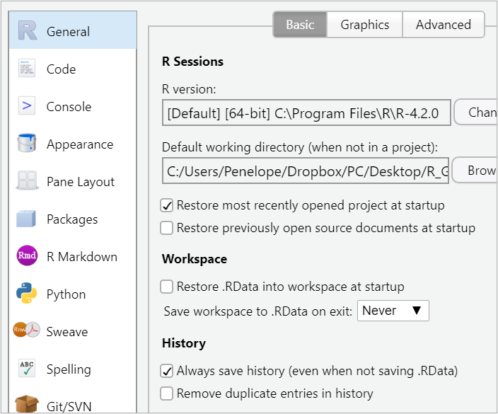

```{r setup, include=TRUE}

# this line specifies options for default options for all R Chunks
knitr::opts_chunk$set(echo=T, highlight=T,
                      scipen=100,          # suppresses scientific notation
                      echo = TRUE)

# suppress scientific notation
options(scipen=100)

# install helper package that loads and installs other packages, if needed
if (!require("pacman")) install.packages("pacman", repos = "http://lib.stat.cmu.edu/R/CRAN/")

# install and load required packages
# flexdashboard not required for today, but make sure you can install and load it
pacman::p_load(pacman,tidyverse, gridExtra, magrittr)

# verify packages
p_loaded()

```


### R Global General Options

- Few simple options can greatly help you.

- Workspace:

   - Set save workspace to **Never**
   
- Maintain defaults for 

   - Restore most recently opened project at startup
   
   - Always save history
   
   - These two options can help you if R crashes or your computer does.



---

### R Global Appearance Options

- Changing RStudio appearance options may ease eye strain.

- On a Mac go to:

   - RStudio > Preferences > Appearance
  
- On a Windows OS go to:

   - Tools > Global Options > Appearance
   
- You also may switch between `Source` and `Visual` mode.

   - Some options (like  slides) only work with `Source` mode.
   
   - Standard R Markdown HTML files work with either mode.
   
   - `Visual` mode is helpful, but can cause editing glitches.
   


---

### Reminders:

#### Pre-class Survey Due Wed. 9/7

#### HW 1 (Parts 1, 2, and 3) Due 9/7

Textbook: A [list of useful sections can be found here](https://docs.Google.com/spreadsheets/d/1yhUSJAJQ4VVjVBpiv3_C2D3tQs2SmJjynSq9chqXOwc/edit?usp=sharing) and will be updated as the course progresses.

#### Reminders from Week 1 

**File Management:**

- Creating an R Project 

  - Adding a `code_data_output` folder
  
  - saving an R Markdown folder to this folder
  
- Editing a setup chunk in a new RMarkdown file

- Creating and editing R chunks

---

### Reminders from Week 1 

**Data Management:**

- Selecting data by rows and columns with square brackets

- Examining data with R commands: `glimpse`, `summary`, `unique`, `table`

- Types of variables

   - numeric variables (*`<dbl>`*, *`<int>`*)
   
   - categorical variables (*`<chr>`*, *`<fct>`*, *`<ord>`*)
   
   - Type of variable dictates how we examine, summarize and present the data

- Using piping, `|>` to write R code more efficiently.

- Using the `c()` operator to create a group of values

- Using `$` to specify a variable within a dataset

- Using `%in%` to specify a group for values

---

### Additional R syntax

- [Operators in R](https://www.statmethods.net/management/operators.html)


### Week 2 In-class Exercises (TP L3 - Q1)

***TurningPoint Session ID: bua455s22***

Use the **Operators in R** reference link above to find the operator that is put before **`=`** to indicate **not equal to**.

This same operator can be put before any value, e.g., **`X`**, to indicate **not X**.

---

### Introduction to `dplyr`

Recall the `starwars` data from Week 1

```{r save starwars data, echo=F}
my_starwars <- starwars

my_starwars_plt <- my_starwars |>
  select(species, sex, height, mass) |>
  filter(species %in% c("Human", "Droid")) |>
  mutate(bmi = mass/((height/100))^2) |>
  filter(!is.na(bmi)) 

```


#### Original data

```{r original dataset}
my_starwars |> glimpse(width=40)

```


#### Modified data

```{r modified dataset}
my_starwars_plt |> glimpse(width=40)

```

---

### Data Mgmt for a Boxplot Visualization

In Week 1, we looked briefly at a preview of some data management of the `starwars` data for a boxplot visualization:

```{r starwars data mgmt}

# dataset my_starwars_plt is created for a plot
# used select command to select variables
# used filter command to filter data to only to species, Humans and Droid
# used mutate command to create new variable bmi
  # bmi = weight(kg)/height(m)^2
# filtered out observations where bmi was a missing value, NA
my_starwars_plt <- my_starwars |>
  select(species, sex, height, mass) |>
  filter(species %in% c("Human", "Droid")) |>
  mutate(bmi = mass/((height/100))^2) |>
  filter(!is.na(bmi)) 

```

**Today we will examine each data management step above in the subsequent panels of this slide.**

---

### Step by Step Data Management

#### Select Variables

- Use the `select` command in the `dplyr` package to select variables.

- The `select` command also orders the variables as as written in the command.

- We save this dataset with fewer variables as a **NEW** dataset, `my_starwars_plt`.

- `glimpse` is NOT required at each step but we will use here to examine the dataset modifications.

```{r select variables and save as new dataset}

# select variables using select command and save as my_starwars_plt
# notice that the pipe operator |> is used to make data management more efficient

my_starwars_plt <- my_starwars |>       # save as new dataset   
  select(species, sex, height, mass) |> # select command        
  glimpse(width=60)

```

---

#### Filter Observations

- The `filter` command in the `dplyr` package is one common way to filter data.

- Datasets can be filtered by numeric values, or character (text), or factor levels

- A **very** useful operator for selecting data from specific categories is `%in%`, contained in.

```{r filter observations by factor level}

# filter the data to include only two levels (categories) of species, Human and Droid
my_starwars_plt <- my_starwars |>
  select(species, sex, height, mass) |>
  filter(species %in% c("Human", "Droid")) |> # filter command 
  glimpse(width=60)

```

---

#### New Variable

- The `mutate` command in the `dplyr` package can be used to create a new variable.

- New variables can be created from other variables or can overwrite variables (be careful)

- We will use `mutate` for many varied tasks throughout this course.

```{r create bmi from height and mass using mutate}

# bmi is calculated from mass and height using the mutate command
# height data is scaled to centimeters and squared
my_starwars_plt <- my_starwars |>
  select(species, sex, height, mass) |>
  filter(species %in% c("Human", "Droid")) |>
  mutate(bmi = mass/((height/100))^2) |>      # mutate command 
  glimpse()

```

---

#### Remove NA's

- A common task in Data Management is removing missing values.

- In R these are denoted as `NA`

- Missing values can be filtered out using `filter`, the command `is.na`, and the operator `!`.

```{r filter out observations with missing bmi values}

# final step below excludes observations for which BMI is missing
my_starwars_plt <- my_starwars |>
  select(species, sex, height, mass) |>
  filter(species %in% c("Human", "Droid")) |>
  mutate(bmi = mass/((height/100))^2) |>
  filter(!is.na(bmi)) |>
  glimpse(width=60)

```

---

### Week 2 In-class Exercises (TP L3 - Q2)

***TurningPoint Session ID: bua455s22***

The select command is used to select `___` and can be used to `___` them.

---

### **`slice`** and More about **`filter`**

In both examples below, three variables of the `my_starwars` data are selected.


