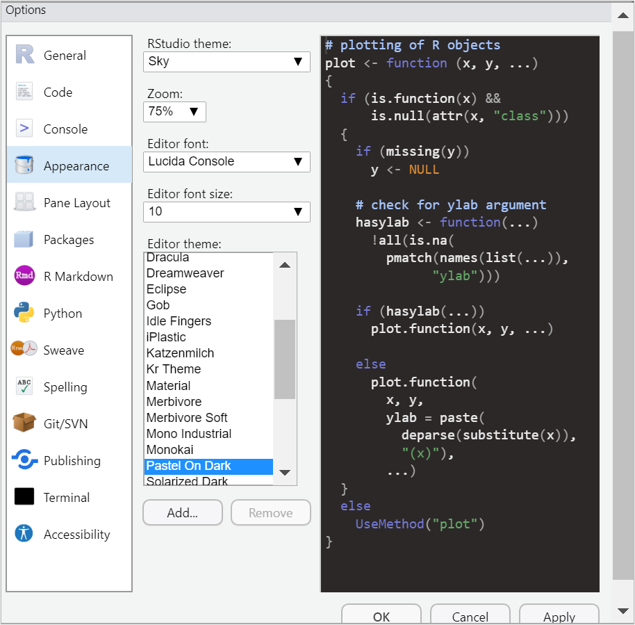

```{r setup, include=TRUE}

# this line specifies options for default options for all R Chunks
knitr::opts_chunk$set(echo=T, 
                      highlight=T)

# suppress scientific notation
options(scipen=100)

# install helper package (pacman) if needed
if (!require("pacman")) install.packages("pacman", repos = "http://lib.stat.cmu.edu/R/CRAN/")

# install and load required packages
# pacman should be first package in parentheses and then list others
pacman::p_load(pacman, tidyverse, gridExtra, magrittr)

# verify packages (comment out in finished documents)
p_loaded()

```

---

### R Global General Options

- A few simple options can greatly help you.

- Workspace:

   - Set save workspace to **Never**
   
- Maintain defaults for 

   - Restore most recently opened project at startup
   
   - Always save history
   
   - These two options can help you if R crashes or your computer does.


---

### R Global Appearance Options

- Changing RStudio appearance options may ease eye strain.

- On a Mac go to:

   - RStudio > Preferences > Appearance
  
- On a Windows OS go to:

   - Tools > Global Options > Appearance
   
- You also may switch between `Source` and `Visual` mode.

   - Some options (like  slides) only work with `Source` mode.
   
   - Standard R Markdown HTML files work with either mode.
   
   - `Visual` mode is helpful, but can cause editing glitches.
   


---

### R Markdown Options

- Changing R Markdown options will make it easier to navigate your work

- On a Mac go to:

   - RStudio > Preferences > R Markdown
  
- On a Windows OS go to:

   - Tools > Global Options > R Markdown
   
- The main option that many students find helpful:

  - **Show in document outline: Sections and Named Chunks**

- NOTE: R Notebooks are a paired down version of R Markdown

  - Useful for work that will not be presented.
   


---

### Reminders:

#### Pre-class Survey Due Wed. 9/6

#### HW 1 (Parts 1, 2, and 3) Due 9/6

.bg-azure.b--dark_cyan.ba.bw2.br3.shadow-5.ph3.mt2.mb2[

Textbook: A [list of useful sections can be found here](https://docs.Google.com/spreadsheets/d/1yhUSJAJQ4VVjVBpiv3_C2D3tQs2SmJjynSq9chqXOwc/edit?usp=sharing) 

]

---

#### Reminders from Week 1 

**File Management:**

- Creating an R Project 

  - Adding a `code_data_output` folder
  
  - saving an R Markdown folder to this folder
  
- Editing a setup chunk in a new RMarkdown file

- Creating and editing R chunks

---

### Reminders from Week 1 

**Data Management:**

- Selecting data by rows and columns with square brackets

- Examining data with R commands: `glimpse`, `summary`, `unique`, `table`

- Types of variables

   - numeric variables (*`<dbl>`*, *`<int>`*)
   
   - categorical variables (*`<chr>`*, *`<fct>`*, *`<ord>`*)
   
   - Type of variable dictates how we examine, summarize and present the data

- Using piping, `|>` to write R code more efficiently.

- Using the `c()` operator to create a group of values

- Using `$` or `pull` or `select` to specify a variable within a dataset

---

### Additional R syntax

**Operators** are used to filter data or create new variables

For example 

- Filter a dataset of heights to heights <= 6 feet

- Filter a dataset of cars to exclude SUVs

**[Operators in R](https://www.statmethods.net/management/operators.html)** is a good reference for some of the common operators used for data management in R.


### Week 2 In-class Exercises (L3 - Q1)

***Session ID: bua455s23***

Use the **Operators in R** reference link above to find the operator that is put before **`=`** to indicate **not equal to**.

This same operator can be put before any value, e.g., **`X`**, to indicate **not X**.

---

### Introduction to `dplyr`

Recall the `starwars` data from Week 1 [Online dataset documentation](https://dplyr.tidyverse.org/reference/starwars.html)


```{r save starwars data, echo=F}
my_starwars <- starwars

my_starwars_plt <- my_starwars |>
  select(species, sex, height, mass) |>
  filter(species %in% c("Human", "Droid")) |>
  mutate(bmi = mass/((height/100))^2) |>
  filter(!is.na(bmi)) 

```

---

#### Original data

```{r original dataset}
my_starwars |> glimpse(width=40)

```


#### Modified data

```{r modified dataset}
my_starwars_plt |> glimpse(width=40)

```


---

### Data Mgmt for a Boxplot Visualization

In Week 1, we looked briefly at a preview of some data management of the `starwars` data for a boxplot visualization:

```{r starwars data mgmt}

# dataset my_starwars_plt is created for a plot
# used select command to select variables
# used filter command to filter data to only to species, Humans and Droid
# used mutate command to create new variable bmi
  # bmi = weight(kg)/height(m)^2
# filtered out observations where bmi was a missing value, NA
my_starwars_plt <- my_starwars |>
  select(species, sex, height, mass) |>
  filter(species %in% c("Human", "Droid")) |>
  mutate(bmi = mass/((height/100))^2) |>
  filter(!is.na(bmi)) 

```


**Today we will examine each data management step above in the subsequent panels of this slide.**

---

### Select Variables

- Use the `select` command in the `dplyr` package to select variables.

- The `select` command also orders the variables as written in the command.

- We save this dataset with fewer variables as a **NEW** dataset, `my_starwars_plt`.

- `glimpse` is NOT required at each step but we will use here to examine the dataset modifications.

```{r select variables and save as new dataset}

# select variables using select command and save as my_starwars_plt
# notice that the pipe operator |> is used to make data management more efficient

my_starwars_plt <- my_starwars |>       # save as new dataset  
  select(species, sex, height, mass) |> # select command       
  glimpse(width=60)

```

---

### Filter Observations

- The `filter` command in the `dplyr` package is one common way to filter data.

- Datasets can be filtered by numeric values, or character (text), or factor levels

- A **very** useful operator for selecting data from specific categories is `%in%`, contained in.

```{r filter observations by factor level}

# filter the data to include only two levels (categories) of species, Human and Droid
my_starwars_plt <- my_starwars |>
  select(species, sex, height, mass) |>
  filter(species %in% c("Human", "Droid")) |>    # filter command 
  glimpse(width=60)

```

---

### Create a New Variable

- The `mutate` command in the `dplyr` package can be used to create a new variable.

- New variables can be created from other variables or can overwrite variables (be careful)

- We will use `mutate` for many varied tasks throughout this course.

```{r create bmi from height and mass using mutate}

# bmi is calculated from mass and height using the mutate command
# height data is scaled to centimeters and squared
my_starwars_plt <- my_starwars |>
  select(species, sex, height, mass) |>
  filter(species %in% c("Human", "Droid")) |>
  mutate(bmi = mass/((height/100))^2) |>      # mutate command 
  glimpse()

```

---

### Remove `NA`s

- A common task in data management is removing missing values.

- In R, missing values are denoted as `NA`

- Missing values can be filtered out using `filter`, the command `is.na`, and the operator `!`.

```{r filter out observations with missing bmi values}

# final step below excludes observations for which BMI is missing
my_starwars_plt <- my_starwars |>
  select(species, sex, height, mass) |>
  filter(species %in% c("Human", "Droid")) |>
  mutate(bmi = mass/((height/100))^2) |>
  filter(!is.na(bmi)) |>                      # filter out NA's 
  glimpse(width=60)

```

---

### Week 2 In-class Exercises (L3 - Q2)

***Session ID: bua455s23***

The select command is used to select `___` and can be used to `___` them.

---

### **`slice`** and more about **`filter`**

In both examples below, three variables of the `my_starwars` data are selected.

- Data can be sliced by row location

```{r starwars sliced}
# slice data to first 5 rows and last 5 rows
(my_starwars_sliced <- my_starwars |>
  select(name, height, species) |>
  slice(1:5, 83:87))                              
```


- Data can be filtered by numerical values

```{r starwars filtered by height}
# filter data to heights of 200 or more
(my_starwars_tall <- my_starwars |> 
  select(name, height, species) |>
  filter(height >= 200))                          
```

---

### Why do we do these data management tasks?

- Filtering data to a subset by value

- Slicing data by row number

- Selecting variables

- Removing missing values

- Creating new variables 

These are all the most common tasks that are done to raw data to make it **usable**.

**Usable** data can communicate information:

- Can be summarized in a table for presentation
- Can be visualized in a plot
- Can be analyzed using statistical models 
- Can be presented or published

<br>

In the next demonstration:

We examine how these managed data are **USED** to create a simple plot that is then formatted for presentation.

---

### Basic boxplot (Two Code Formats)

#### Format 1:

```{r fig.dim=c(7,5)}
# useful for simple plots
my_starwars_plt |> 
  ggplot() +
  geom_boxplot(aes(x=species, y=bmi))              
```

#### Format 2:

```{r fig.dim=c(7,5)}
# useful for overlaying plot features
my_starwars_plt |> 
  ggplot(aes(x=species, y=bmi)) +                 
  geom_boxplot()
```

---

### Saved Plot

```{r unformatted saved boxplot, fig.width=8, fig.height=6, fig.align='center'}
(sw_box1 <- my_starwars_plt |>                    
  ggplot() +
  geom_boxplot(aes(x=species, y=bmi)))            
```

---

### `fill` option

```{r saved boxplot with fill, fig.width=8, fig.height=6, fig.align='center'}
(sw_box2 <- my_starwars_plt |> 
  ggplot() +
  geom_boxplot(aes(x=species, y=bmi, fill=sex)))  
```

---

### format background

```{r saved boxplot with fill and theme,  fig.width=8, fig.height=6, fig.align='center'}
(sw_box3 <- my_starwars_plt |> 
  ggplot() +
  geom_boxplot(aes(x=species, y=bmi, fill=sex)) +
  theme_classic())                               

```

---

### R code - Final Plot

```{r code for final plot}
# created a factor variable sexF to modify order (levels) for plot
my_starwars_plt <- my_starwars_plt |>
  mutate(sexF = factor(sex, 
                       levels = c("male", "female", "none"),
                       labels =c("Male", "Female", "None")))

# formatted plot with factor variable, text formatted, and borders
sw_box4 <- my_starwars_plt |>                                       
  ggplot() +                                                        
  geom_boxplot(aes(x=species, y=bmi, fill=sexF)) +                  
  theme_classic() +                                                 
  labs(title="Comparison of Human and Droid BMI",
       subtitle="22 Humans and 4 Droids from Star Wars Universe",
       caption="Data Source: dplyr package in R",
       x="",y="BMI", fill="Sex") + 
  theme(plot.title = element_text(size = 20),
        plot.subtitle = element_text(size = 15),
        axis.title = element_text(size=18),
        axis.text = element_text(size=15),
        plot.caption = element_text(size = 10),
        legend.text = element_text(size = 12),
        legend.title = element_text(size = 15),
        panel.border = element_rect(colour = "lightgrey", fill=NA, size=2),
        plot.background = element_rect(colour = "darkgrey", fill=NA, size=2))
```

---

### Final Plot

```{r final plot, echo=F,  fig.width=9, fig.height=7, fig.align='center'}
sw_box4
```

---

### Showing Plots in A 2x2 Grid

- Another common presentation task is to show a grid, row, or column of plots.
- Final plot  is simplified for showing in the 2x2 grid

```{r format final plot for grid, echo=F}
sw_box4_grid <- my_starwars_plt |>
  ggplot() +
  geom_boxplot(aes(x=species, y=bmi, fill=sexF)) + 
  theme_classic() + 
  labs(title="Human and Droid BMI",
       x="",y="BMI", fill="Sex")
```


```{r 4 plots in a grid, fig.dim=c(10,5.5), fig.align='center', message=FALSE, out.extra='style="background-color: #ADB3B8; padding:5px"'}
(sw_grid <- grid.arrange(sw_box1, sw_box2, sw_box3, sw_box4_grid, ncol=2))   #2x2 grid of plots

```


---

### Exporting a Plot: Two Methods

**Method 1:**

1. Right click on plot on right
2. Select 'Save image as...'
3. Save image as .png file (or other preference)

***Notes***

- This method is very quick and is great for saving one plot at a time.
- Ideally work should be saved to your `code_data_output` folder.


```{r print final plot, echo = F, fig.dim=c(8,6)}
sw_box4
```


**Method 2:**

- Use `ggsave` command
- Defaults to last plot displayed
- Below I override the default to specify plot I want.

 
```{r export final plot, echo=T}
ggsave("StarWars_BMI_Boxplot.png", 
       plot=sw_box4, width = 8, height = 6)
```

---

### Creating a README File

**in HW 2 you will:**

- Create and modify an R Markdown file

- Knit R Markdown file to create an HTML file 

- Create a README file 

**A README file documents all files in your R project**

- README files can be simple or complex.

- BUA 455 will use one README file format

   - [Empty README file template](https://drive.google.com/file/d/1lsqpffL5b5XsTSrV7VKfWeYIDxoH1PZS/view?usp=sharing)

   - [Completed README file for Week 2 lectures](https://drive.google.com/file/d/1Q_vzUumn_ojAjNoATedtu4J78_fILwPs/view?usp=drive_link)

**Editing a README.txt file**

  - in RStudio: File > Open File > click on file
  
  - in ***Notepad*** (Windows OS) or ***TextEdit*** (Mac OS)

---

### Week 2 In-class Exercises (L3 - Q3 & Q4)

***Session ID: bua455s23***

**`Q3.`** What type of file is the README file?

<br>

**`Q4.`** We will use the `pacman` R package, in every lecture, and assignment because it simplifies installing a loading other packages.

There is another package (actually it's a package suite that includes both `dplyr` and `ggplot2`) that we will will we use in every lecture, assignment, and quiz in BUA 455.

The name of this package suite is `____`.


---

### Introduction to HW 2


**In class we will work through HW 2 Instructions**

Students are encouraged but not required to ***work with a partner*** at least once for HW2, HW 3, or HW 4).

   - All students are responsible for understanding **all** coding 
   
   - Working with a partner at least once will help during group project.
   
**Easy Collaboration for now:**

  - Each student makes their own R project and internal `code_data_output` folder for HW 2.
  - Email or share .Rmd file in a cloud drive
  
**[Posit Cloud](https://posit.cloud/)** allows for "google-drive" style collaboration on an R project with 5 people ($5/month). 
  
**GitHub** used for collaboration and version control in more advanced courses and other disciplines (Not required in this course).

---

### HW 2 Purpose

**HW Assignment 2** will give you experience with:

- Creating an R Project Directory and a code_data_output folder (Review)

- Creating, saving, using an R Markdown file (Review)

- Knitting (rendering) an R Markdown file to create an HTML file

- Creating a README file

- Working with a larger dataset

- Using the **`dplyr`** package to **`select`** variables and **`slice`** and **`filter`** data

- Creating a basic plot with minimal formatting

You are encouraged to work with someone on HW 2, HW 3, or HW 4.

  - Practice sharing files with a partner.

---

### HW 2 - First Steps

**`0.`** You are encouraged to work with others and and experiment with sharing code (.Rmd files), but each student should create their own project and .Rmd file to submit.

**`1.`** Create an R project named **`HW 1 <first name> <last name>`**
   
**`2.`** Create a folder in your R project labeled **`code_data_output`**.

**`3.`** Download the provided file, **[`HW2_Template.Rmd`]()** 

**`4.`** Save the downloaded **`HW2_Template.Rmd`** file to your code_data_output folder

- Change file name to be **`HW2_FirstName_LastName.Rmd`**

  - For example, I would change the template file to be named **`HW2_Penelope_Pooler.Rmd`**
   
- Change title in the file header to be 'HW 2'
   
- Specify yourself as the author
   
**NOTES** 

- Provided header text below shows the correct format.
- This header text also creates a floating Table of Contents (toc).
   
```
---
title: "HW 2"
authors: "Penelope Pooler"
date: "Due 2/1/2023"
output: 
  html_document:
    toc: true
    toc_depth: 4
    toc_float: true
---

```

<br>

**`5.`** Modify the **`setup`** chunk 

- The **`setup`** chunk text shown below has packages and setup options for HW 2.

- Copy and paste text into the setup chunk of your HW 2 Markdown (**`.Rmd`**) file that you created from the provided template.
   

```
# this line specifies options for default options for all R Chunks
knitr::opts_chunk$set(echo=T, highlight=T)

# suppress scientific notation
options(scipen=100)

# install helper package (pacman) if needed
if (!require("pacman")) install.packages("pacman", repos = "http://lib.stat.cmu.edu/R/CRAN/")

# install and load required packages
# pacman should be first package in parentheses and then list others
pacman::p_load(pacman, tidyverse, gridExtra, magrittr)

# verify packages (comment out in finished documents)
p_loaded()

```

<br>

**`6.`** Click the green triangle or type Ctrl/Cmd + Shift + Enter to run this setup chunk.


---

### HW 2 - Part 1 

#### Chunk 2: Examining the `diamonds` Data

#### Notes

- This chunk reviews the **`glimpse`** and **`unique`** commands from Week 1.

- **`diamonds`** is large dataset that is part of the **`ggplot2`** package in the tidyverse suite.

- Provided code for HW 2 - Part 1 (Chunk 2) **will not run** until the **`tidyverse`** package suite is loaded in the **`setup`** chunk.

- When you run the **`glimpse()`** command you will see the variable type ***`<ord>`***, which is an **ordered factor variable**. 

<br>

#### Steps to Follow

**`1.`** Run the R code in the provided R chunk  for HW 2 - Part 1 (Chunk 2) which reviews:
   
- how to save a dataset and examine it using **`glimpse`**
   
- how to examine the levels of a variable using **`unique`**

- traditional and piped code to do the same task

<br>


**`2.`** Use the **`unique`** command with or without piping to examine the levels of:

- the **`clarity`** variable

- the **`color`** variable

- The new **`unique`** commands that you write should be **ADDED** to Chunk 2.

<br>

**`3.`** Answer Blackboard Questions 1 - 3.

<br>

#### Provided R Code

```
# save the diamonds dataset to your Global Environment
my_diamonds <- diamonds

# show data summary
# without piping
glimpse(my_diamonds)

# with piping
my_diamonds |> glimpse()

# examine ordinal variables using unique
# without piping
unique(my_diamonds$cut)

# with piping
# pull command selects a single variable from a dataset
my_diamonds |> pull(cut) |> unique()

# choose one of these methods to examine:

# ordered levels of clarity

# ordered levels of color

```

---

### Week 2 In-class Exercises (L4 - Q1)

***Session ID: bua455s23***

**This is also BB Question 1 of HW 2**

How many rows and columns are in the `diamonds` dataset that is saved as `my_diamonds` to your Global Environment?

- `____` observations (rows)

- `____` variables (columns)

---

class: middle

### Week 2 In-class Exercises (L4 - Q2)

***Session ID: bua455s23***


How many variables in the `my_diamonds` dataset are ordinal (ordered) factor variables? 


- In the `glimpse(my_diamonds)` output, these variables are labeled *`<ord>`*.

---

### HW 2 - Part 2

#### Chunk 3: Selecting variables in a dataset

#### Notes

- This chunk demonstrates using the **`select`** command to select variables in a dataset.

- In the provided code for HW 2 - Part 2 (Chunk 3),there are **three code examples** that select the first 7 variables in the my_diamonds dataset and save them as a new data set.

  - **`my_diamonds1`** is created by specifying variables to **INCLUDE**
  
  - **`my_diamonds2`** is created by specifying variables to **EXCLUDE**
  
  - **`select`** is ALSO used to reorder the variables (**`price`** is first)
  
<br>

#### Steps to Follow

**`1.`** Create **`my_diamonds3`** using the select command to only **INCLUDE** the first **FIVE** variables: 

- **price, carat, cut, color, clarity**

<br>

**`2.`** Create my_diamonds4 which will be identical to my_diamonds3, but is created by **EXCLUDING** the last FIVE variables using the **`!`** operator and the **`c(...)`** operator to group the variables: 

- **depth, table, x, y, z**

<br>

#### Provided R Code

```{r selecting variables in a dataset, eval = F}
# creates a new dataset, my_diamonds1
# selects variables we want to keep
# select can also re-order variables (price is now first)
my_diamonds1 <- my_diamonds |>
  select(price, carat, cut, color, clarity, depth, table)

# same command, but shorter
# used : to specify consecutive variables
my_diamonds1 <- my_diamonds |>
  select(price, carat:table)

# creates a new dataset, my_diamonds2
# identical to above but we use ! to exclude variables
my_diamonds2 <- my_diamonds |>
  select(!c(x,y,z))

# create my_diamonds3 using select to keep these variables only: 
# price, carat, color, cut, clarity

# create my_diamonds4 using select to EXCLUDE these variables 
# depth, table, x, y, z

```

---

### HW 2 - Part 3

#### Chunk 4: Selecting rows by row number

#### Notes

- This chunk demonstrates using the **`slice`** command to select observations (rows).

- In the provided code for HW 2 - Part 3 (Chunk 4), and subsequent chunks you will continue to build on your code from Part 2 (Chunk 3) with more commands.

- Using piping in your code makes this process more efficient.

<br>

#### Steps to Follow

**`1.`** Copy and the code you wrote to create **`my_diamonds3`** in Chunk 3 and paste this code into Chunk 4.

**`2.`** Use the examples to add on to your code and select rows:
1001 through 30000 and 45001 through 50000

- This dataset should still be named **`my_diamonds3`**

- Piping will make your coding more efficient and easier to read.

<br>
   
**`3.`** Answer Blackboard Question 4 to verify that your dataset is correct.

<br>

#### Provided R Code

```{r slicing data by row number, eval = F}

my_diamonds1 <- my_diamonds |>
  select(price, carat, cut, color, clarity, depth, table) |>
  slice(5001:35000)

my_diamonds2 <- my_diamonds |>
  select(price, carat:table) |>
  slice(1, 200, 2301:3000, 29000:32000)

# Use the code from Chunk 3  that you wrote to create my_diamonds3
# add on to that code to limit my_diamonds3 to rows:
# 1001 through 30000 and 45001 through 50000

```

---

### HW 2 - Part 4

#### Chunk 5: Filtering data by value and summarizing

#### Notes

- This chunk demonstrates 

   - using the **`filter`** command to select rows by variables values
   
   - using the **`summary`** command

- The **`filter`** command enables us to select observations by one or more values of one or more variables.

- You can use multiple consecutive **`filter`** commands or you can use the **and** operator, **`&`**, or the **or** operator, **`|`**.

- You can use filter to **INCLUDE** rows or **EXCLUDE** rows with **`!`**.

- The provided code includes multiple examples of how to complete the same two filtering tasks.

<br>

#### Steps to Follow

**`1.`** Copy the code you wrote in Chunk 4 and then paste it into Chunk 5.

**`2.`** Add the specified slice command  to subset the **`my_diamonds3`** dataset in Chunk 5.

**`3.`**. Use one of the examples in the provided R code for Chunk 5 to complete these **TWO** specified filter tasks:

- filter **`my_diamonds3`** to diamonds weighing 1.5 or more carats

- filter **`my_diamonds3`** to these categories: **Very Good, Premium, Ideal**

<br>
   
**`4.`** Use the example **`summary`** command code to summarize the factor variable **`clarity`** in the final **`my_diamonds3`** dataset.

**`5.`** Answer Blackboard Questions 5 and 6 to verify that you have completed these steps correctly.

<br>

#### Provided R Code

```
# filtering my_diamonds1 to 
# carat weight greater than or equal to 2 (carat >=2)
# cut is Premium or Ideal (cut %in% c("Premium", "Ideal"))
my_diamonds1 <- my_diamonds |>
  select(price, carat:table) |>
  slice(5001:35000) |>
  filter(carat >= 2) |>
  filter(cut %in% c("Premium", "Ideal"))

# same filtering tasks as above
# !cut used to exclude cuts Fair, Good, Very Good
my_diamonds1 <- my_diamonds |>
  select(price, carat:table) |>
  slice(5001:35000) |>
  filter(carat >= 2) |>
  filter(!cut %in% c("Fair", "Good", "Very Good"))

# same filtering tasks as above
# both filtering tasks combined using and operator &
my_diamonds1 <- my_diamonds |>
  select(price, carat:table) |>
  slice(5001:35000) |>
  filter(carat >= 2 & cut %in% c("Premium", "Ideal")) 

# summary of color in my_diamonds1
summary(my_diamonds1$color)

# same summary with piping
my_diamonds1 |> pull(color) |> summary()

# Use any one of the examples above to filter my_diamonds3 to:
# carat weight greater than or equal to 1.25
# cut is Very Good, Premium, or Ideal 


# summarize clarity in the my_diamonds3 dataset (number of obs. in each level)
# use the summary command, with or without piping
# above I show how I summarized the color variable

```

---

### HW 2 - Part 5

#### Chunk 6: Creating Basic Plots

#### Notes

- The provided R code demonstrates using 
  
   - **`ggplot`** to make some basic plots
  
   - **`grid.arrange`** to present multiple plots in a grid or column.

<br>

- In Part 5, you will create a chunk and copy the provided R code into the chunk you create.

<br>

#### Steps to Follow

**`1.`** Create a new chunk (Chunk 6) under the **HW 2 - Part 5** heading in your HW 2 Markdown file.

- Name this new chunk **`creating plots with ggplot`**

<br>
   
**`2.`** Copy and paste the provided R code below into the chunk you created.

**`3.`** Use the example scatter plot code below to create a saved plot named **`scatter_cut`**.

- This will be similar to the code for the **`scatter_clarity`** scatter plot.

- Remove **`#`** at the beginning of this line **`# scatter_cut <-`** to start code.

- Replace **`color=clarity`** with **`color=cut`**.

<br>

**`4.`** Use the example code provided below to create a saved plot named **`scatter_color`**.

- This will be similar to the code for the **`scatter_clarity`** scatter plot.

- Remove **`#`** at the beginning of this line **`# scatter_color <-`** to start code.

- Replace **`color=clarity`** with **`color=color`**.

**`5.`** Use the provided **`grid.arrange`** command to create a 2x2 grid of all four scatter plots.
   
- Remove **`#`** at the beginning of the line with **`grid.arrange(..., ncol=2)`**

- This code will only work if you use the provided names to save your scatterplots.

<br>
   
**`6.`** Use the provided example boxplot code below to create a saved plot named **`box_clarity`**
 
- This will be similar to the provided code for the side-by-side grouped boxplot, **`box_color`**.

<br>
   
**`7.`** Use the provided **`grid.arrange`** command to create a stacked column of the two boxplot figures.
   
- Remove **`#`** at the beginning of the line with **`grid.arrange(..., ncol=1)`**

- This code will only work if you use the provided name to save your new boxplot figure.

<br>

**`8.`** Answer Blackboard Questions 7 and 8 based on the plots you create.

<br>

####  Provided Scatter Plots R code

```{r scatter plots R code, eval=F}
# scatter_none is the most basic scatter plot of carat vs. price 
# no other variables are included
# to view this plot by itself (not required), enclose code in parentheses
scatter_none <- my_diamonds |>
   ggplot() +
   geom_point(aes(x=carat, y=price))

# scatter_clarity adds the option color=clarity to the aes (aesthetic)
# observations are color coded by diamond clarity level
# theme_classic() added to remove background
scatter_clarity <- my_diamonds |>
  ggplot() +
  geom_point(aes(x=carat, y=price, color=clarity)) +
  theme_classic()

# create plot named scatter_cut using the above code
# change color=clarity to color=cut
# scatter_cut <- 

# create plot named scatter_color using the above code
# change color=clarity to color=color
# scatter_color <- 

# plot all 4 plots above in a 2x2 grid and answer Blackboard Questions
# grid.arrange(scatter_none, scatter_clarity, 
#              scatter_color, scatter_cut, ncol=2)

```

<br>

#### Provided Boxplots R code

```{r boxplots R code, eval=F}
# below is a plot of grouped side-by_side boxplots 
# Within each cut category there is a separate boxplot for each color
# this is one good way to examine categorical data

# code is enclosed in parentheses 
# plot is saved as box_color AND is shown on the screen
(box_color <- my_diamonds3 |>
  ggplot() +
  geom_boxplot(aes(x=cut, y=price, fill=color))+ 
  theme_classic())


# create a plot of grouped side-by_side boxplots that show
# boxplots for each clarity category with each cut category

# same plot as above but change fill=color to fill=clarity

# name this plot box_clarity
# (box_clarity <- )


# plot these two sets of plots in a stacked column (nrow=1)
# grid.arrange(box_color, box_clarity, ncol=1)

```

---

### HW 2 - Final Steps

**Reminder:** You are welcome and encouraged to work together and practice sharing Markdown (`Rmd`) files, but each student should submit their own zipped R project and Blackboard assignment.

**`1.`** Save your completed HW 2 R Markdown File (.Rmd) to your code_data_output folder

**`2.`** Knit your R markdown File.

**`3.`** Answer all 8 Blackboard questions associated with this assignment.

**`4.`** Create a README file for HW 2 using the [empty README template](https://drive.google.com/file/d/1RlJkuJWRsaqy7KWo718bNTl570T8n_hi/view?usp=sharing) provided with the HW 2 files.

**`5.`** Zip your entire Project Directory into a compressed File and submit it.

- The zipped project directory should contain:

   - The `code_data_output` folder with 2 files in it:
   
      - the completed Markdown file (`.Rmd`) 
      - the knitted (rendered) HTML file (`.html`)
      
   - In addition to the `code_data_output` folder, the outer project folder should ALSO include
      
      - The complete `README.txt` file saved with name of project, (e.g. `HW 2 Penelope Pooler README.txt`) 
      - The .Rproj file


---

### **Key Points from Week 2**

**Building on R Project Skills:**

- Creating and Managing R Projects

- Creating, Editing, Rendering R Markdown Files

- Documenting files in a `README.txt` file

<br>
  
**Data Management and Visualization:**

- Review of
  - `glimpse`, `unique`, `table`, `summary`
  
- Modifying day using `dplyr commands:
  - `select`, `filter` `mutate`, `slice`
  
- Some Useful operators:
  - `!`, `%in%`, `c()`, `is.na`
  
- Intro to plotting data with `ggplot`

<br>

You may submit an 'Engagement Question' about each lecture until midnight on the day of the lecture. 
**A minimum of four submissions are required during the semester.**


