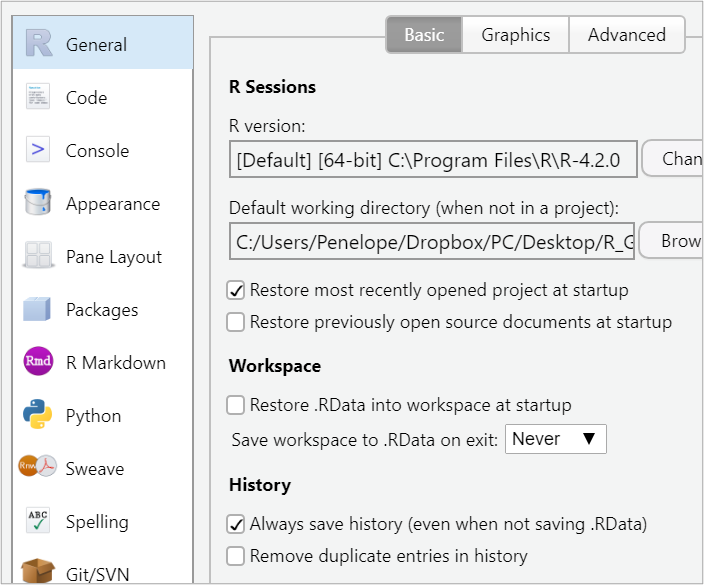

```{r setup, include=FALSE, echo=FALSE}
options(htmltools.dir.version = FALSE)
knitr::opts_chunk$set(
  fig.retina=2,
  #out.width = "75%",
  #out.height = "50%",
  htmltools.preserve.raw = FALSE,      # needed for windows
  scipen=100,                          # suppresses scientific notation
  getSymbols.warning4.0 = FALSE,       # suppresses getSymbols warnings
  cache = FALSE,
  echo = TRUE,
  hiline = TRUE,
  message = FALSE, 
  warning = FALSE
)


# install helper package (pacman)
# pacman loads and installs other packages, if needed
if (!require("pacman")) install.packages("pacman", repos = "http://lib.stat.cmu.edu/R/CRAN/")

# install and load required packages
# pacman should be first package in parentheses and then list others
pacman::p_load(pacman, tidyverse, gridExtra, magrittr)

# verify packages (comment out in finished documents)
p_loaded()


```

```{r xaringan-themer, include=FALSE, warning=FALSE}
library(xaringanthemer)

palette <- c(
  SU_Orange1        = "#F76900",
  SU_Orange2        = "#FF8E00",
  SU_Red_Orange     = "#FF431B",
  SU_Blue1          = "#000E54",
  SU_Blue2          = "#203299",
  SU_Light_Blue     = "#2B72D7",
  SU_White          = "#FFFFFF",
  SU_Light_Gray     = "#ADB3B8",
  SU_Medium_Gray    = "#707780",
  SU_Black          = "#000000", 
  
  steel_blue        = "#4682B4",
  corn_flower_blue  = "#6495ED",
  deep_sky_blue     = "#00BFFF",
  dark_magenta      = "#8B008B",
  medium_orchid     = "#BA55D3",
  lime_green        = "#32CD32",
  light_sea_green   = "#20B2AA",
  chartreuse        = "#7FFF00",
  orange_red        = "#FF4500",
  white_smoke       = "#F5F5F5",
  dark_cyan         = "#008B8B",
  light_steel_blue  = "#B0C4DE",
  indigo            = "#4B0082",
  ivory             = "#FFFFF0",
  light_slate_grey  = "#778899",
  linen             = "#FAF0E6",
  steel_blue        = "#4682B4",
  blue_violet       = "#8A2BE2",
  dodger_blue       = "#1E90FF",
  light_blue        = "#ADD8E6",
  azure             = "#F0FFFF",
  lavender          = "#E6E6FA")

primary_color = "#4682B4"                # steel_blue
secondary_color = "#778899"              # light_slate_grey
white_color = "#FFFFF0"                  # ivory
black_color = "#000080"                  # navy

style_duo_accent(
  primary_color = primary_color,
  secondary_color = secondary_color,
  white_color = white_color,
  black_color = black_color,
  text_color = black_color,
  header_color = primary_color,
  background_color = white_color,
  code_inline_background_color = "#E6E6FA", # lavender
  link_color = "#1E90FF",                   # dodger_blue
  code_inline_color = "#4B0082",            # indigo
  text_bold_color = "#8B008B",              # dark_magenta
  header_font_google = google_font("Open Sans"),
  text_font_google = google_font("Open Sans"),
  code_font_google = google_font("Source Code Pro"),
  colors = palette
)


```

```{r xaringan-panelset, echo=FALSE}
xaringanExtra::use_panelset()
```

```{r xaringan-tile-view, echo=FALSE}
xaringanExtra::use_tile_view()
```

```{r xaringan-fit-screen, echo=FALSE}
xaringanExtra::use_fit_screen()
```

```{r xaringan-tachyons, echo=FALSE}
xaringanExtra::use_tachyons()
```

```{r xaringan-animate-css, echo=FALSE}
xaringanExtra::use_animate_css()
```

```{r xaringan-animate-all, echo=FALSE}
#xaringanExtra::use_animate_all("slide_up")
```

background-image: url("docs_files/images/sloth_faded.png")
background-size: cover

class: bottom, right

## BUA 455 - Week 2

### Introduction to dplyr commands and ggplot  

<br>


#### Penelope Pooler Eisenbies

#### `r Sys.Date()`

[Wikipedia Sloth Page](https://en.wikipedia.org/wiki/Sloth)

---

### R Global General Options

.pull-left[

- Few simple options can greatly help you.

- Workspace:

   - Set save workspace to **Never**
   
- Maintain defaults for 

   - Restore most recently opened project at startup
   
   - Always save history
   
   - These two options can help you if R crashes or your computer does.


]

.pull-right[



]


---

### R Global Appearance Options

.pull-left[

- Changing RStudio appearance options may ease eye strain.

- On a Mac go to:

   - RStudio > Preferences > Appearance
  
- On a Windows OS go to:

   - Tools > Global Options > Appearance
   
- You also may switch between `Source` and `Visual` mode.

   - Some options (like  slides) only work with `Source` mode.
   
   - Standard R Markdown HTML files work with either mode.
   
   - `Visual` mode is helpful, but can cause editing glitches.
]

.pull-right[


]

---


### Reminders:

#### Pre-class Survey Due Wed. 9/7

#### HW 1 (Parts 1, 2, and 3) Due 9/7

.bg-azure.b--dark_cyan.ba.bw2.br3.shadow-5.ph3.mt2.mb2[

Textbook: A [list of useful sections can be found here](https://docs.Google.com/spreadsheets/d/1yhUSJAJQ4VVjVBpiv3_C2D3tQs2SmJjynSq9chqXOwc/edit?usp=sharing) and will be updated as the course progresses.

]

#### Reminders from Week 1 

**File Management:**

- Creating an R Project 

  - Adding a `code_data_output` folder
  
  - saving an R Markdown folder to this folder
  
- Editing a setup chunk in a new RMarkdown file

- Creating and editing R chunks

---

### Reminders from Week 1 

**Data Management:**

- Selecting data by rows and columns with square brackets

- Examining data with R commands: `glimpse`, `summary`, `unique`, `table`

- Types of variables

   - numeric variables (*`<dbl>`*, *`<int>`*)
   
   - categorical variables (*`<chr>`*, *`<fct>`*, *`<ord>`*)
   
   - Type of variable dictates how we examine, summarize and present the data

- Using piping, `|>` to write R code more efficiently.

- Using the `c()` operator to create a group of values

- Using `$` to specify a variable within a dataset

- Using `%in%` to specify a group for values

---

### Additional R syntax

- [Operators in R](https://www.statmethods.net/management/operators.html)


### Week 2 In-class Exercises (TP L3 - Q1)

***TurningPoint Session ID: bua455s22***

Use the **Operators in R** reference link above to find the operator that is put before **`=`** to indicate **not equal to**.

This same operator can be put before any value, e.g., **`X`**, to indicate **not X**.

---

### Introduction to `dplyr`

Recall the `starwars` data from Week 1

```{r save starwars data, echo=F}
my_starwars <- starwars

my_starwars_plt <- my_starwars |>
  select(species, sex, height, mass) |>
  filter(species %in% c("Human", "Droid")) |>
  mutate(bmi = mass/((height/100))^2) |>
  filter(!is.na(bmi)) 

```


.pull-left[

#### Original data

```{r original dataset}
my_starwars |> glimpse(width=40)

```

]

.pull-right[

#### Modified data

```{r modified dataset}
my_starwars_plt |> glimpse(width=40)

```

]

---

.panelset[

.panel[.panel-name[**Complete Data Management**]

### Data Mgmt for a Boxplot Visualization

In Week 1, we looked briefly at a preview of some data management of the `starwars` data for a boxplot visualization:

```{r starwars data mgmt}

# dataset my_starwars_plt is created for a plot
# used select command to select variables
# used filter command to filter data to only to species, Humans and Droid
# used mutate command to create new variable bmi
  # bmi = weight(kg)/height(m)^2
# filtered out observations where bmi was a missing value, NA
my_starwars_plt <- my_starwars |>
  select(species, sex, height, mass) |>
  filter(species %in% c("Human", "Droid")) |>
  mutate(bmi = mass/((height/100))^2) |>
  filter(!is.na(bmi)) 

```

.center[
.bg-azure.b--dark_cyan.ba.bw2.br3.shadow-5.ph3.mt4[
**Today we will examine each data management step above in the subsequent panels of this slide.**

]] 

]

.panel[.panel-name[**Select Variables**]

- Use the `select` command in the `dplyr` package to select variables.

- The `select` command also orders the variables as as written in the command.

- We save this dataset with fewer variables as a **NEW** dataset, `my_starwars_plt`.

- `glimpse` is NOT required at each step but we will use here to examine the dataset modifications.

```{r select variables and save as new dataset}

# select variables using select command and save as my_starwars_plt
# notice that the pipe operator |> is used to make data management more efficient

my_starwars_plt <- my_starwars |>       # save as new dataset  #<<  
  select(species, sex, height, mass) |> # select command       #<<  
  glimpse(width=60)

```

]

.panel[.panel-name[**Filter Observations**]

- The `filter` command in the `dplyr` package is one common way to filter data.

- Datasets can be filtered by numeric values, or character (text), or factor levels

- A **very** useful operator for selecting data from specific categories is `%in%`, contained in.

```{r filter observations by factor level}

# filter the data to include only two levels (categories) of species, Human and Droid
my_starwars_plt <- my_starwars |>
  select(species, sex, height, mass) |>
  filter(species %in% c("Human", "Droid")) |> # filter command #<<
  glimpse(width=60)

```

]

.panel[.panel-name[**New Variable**]

- The `mutate` command in the `dplyr` package can be used to create a new variable.

- New variables can be created from other variables or can overwrite variables (be careful)

- We will use `mutate` for many varied tasks throughout this course.

```{r create bmi from height and mass using mutate}

# bmi is calculated from mass and height using the mutate command
# height data is scaled to centimeters and squared
my_starwars_plt <- my_starwars |>
  select(species, sex, height, mass) |>
  filter(species %in% c("Human", "Droid")) |>
  mutate(bmi = mass/((height/100))^2) |>      # mutate command #<<
  glimpse()

```

]

.panel[.panel-name[**Remove `NA`s**]

- A common task in Data Management is removing missing values.

- In R these are denoted as `NA`

- Missing values can be filtered out using `filter`, the command `is.na`, and the operator `!`.

```{r filter out observations with missing bmi values}

# final step below excludes observations for which BMI is missing
my_starwars_plt <- my_starwars |>
  select(species, sex, height, mass) |>
  filter(species %in% c("Human", "Droid")) |>
  mutate(bmi = mass/((height/100))^2) |>
  filter(!is.na(bmi)) |>                      # filter out NA's #<<
  glimpse(width=60)

```


]

]

---

class: middle

### Week 2 In-class Exercises (TP L3 - Q2)

.pull-left[

<br>
<br>
<br>

***TurningPoint Session ID: bua455s22***

The select command is used to select `___` and can be used to `___` them.

]

.pull-right[


]

---

### **`slice`** and More about **`filter`**

In both examples below, three variables of the `my_starwars` data are selected.

.pull-left[
- Data can be sliced by row location

```{r starwars sliced}
# slice data to first 5 rows and last 5 rows
(my_starwars_sliced <- my_starwars |>
  select(name, height, species) |>
  slice(1:5, 83:87))                              #<<
```
]

.pull-right[

- Data can be filtered by numerical values

```{r starwars filtered by height}
# filter data to heights of 200 or more
(my_starwars_tall <- my_starwars |> 
  select(name, height, species) |>
  filter(height >= 200))                          #<<
```

]


---

.panelset[

.panel[.panel-name[**Basic boxplot**]

.pull-left[

```{r fig.dim=c(7,5)}
# useful for simple plots
my_starwars_plt |> 
  ggplot() +
  geom_boxplot(aes(x=species, y=bmi))              #<<
```

]

.pull-right[

```{r fig.dim=c(7,5)}
# useful for overlaying plot features
my_starwars_plt |> 
  ggplot(aes(x=species, y=bmi)) +                 #<<
  geom_boxplot()
```

]

]


.panel[.panel-name[**Saved Plot**]

```{r unformatted saved boxplot, fig.width=8, fig.height=6, fig.align='center'}
(sw_box1 <- my_starwars_plt |>                    #<<
  ggplot() +
  geom_boxplot(aes(x=species, y=bmi)))            #<<
```

]

.panel[.panel-name[**`fill` option**]

```{r saved boxplot with fill, fig.width=8, fig.height=6, fig.align='center'}
(sw_box2 <- my_starwars_plt |> 
  ggplot() +
  geom_boxplot(aes(x=species, y=bmi, fill=sex)))  #<<
```

]

.panel[.panel-name[**format background**]

```{r saved boxplot with fill and theme,  fig.width=8, fig.height=6, fig.align='center'}
(sw_box3 <- my_starwars_plt |> 
  ggplot() +
  geom_boxplot(aes(x=species, y=bmi, fill=sex)) +
  theme_classic())                               #<<

```

]

.panel[.panel-name[**R code - Final Plot**]

```{r code for final plot}
# created a factor variable sexF to modify order (levels) for plot
my_starwars_plt <- my_starwars_plt |>
  mutate(sexF = factor(sex, 
                       levels = c("male", "female", "none"),
                       labels =c("Male", "Female", "None")))

# formatted plot with factor variable, text formatted, and borders
sw_box4 <- my_starwars_plt |>                                       #<<
  ggplot() +                                                        #<<
  geom_boxplot(aes(x=species, y=bmi, fill=sexF)) +                  #<<
  theme_classic() +                                                 #<<
  labs(title="Comparison of Human and Droid BMI",
       subtitle="22 Humans and 4 Droids from Star Wars Universe",
       caption="Data Source: dplyr package in R",
       x="",y="BMI", fill="Sex") + 
  theme(plot.title = element_text(size = 20),
        plot.subtitle = element_text(size = 15),
        axis.title = element_text(size=18),
        axis.text = element_text(size=15),
        plot.caption = element_text(size = 10),
        legend.text = element_text(size = 12),
        legend.title = element_text(size = 15),
        panel.border = element_rect(colour = "lightgrey", fill=NA, size=2),
        plot.background = element_rect(colour = "darkgrey", fill=NA, size=2))
```

]

.panel[.panel-name[**Final Plot**]

.center[

```{r final plot, echo=F,  fig.width=9, fig.height=7, fig.align='center'}
sw_box4
```

]]]

---

### Showing Plots in A Grid

Final plot  is simplified for showing in the 2x2 grid

```{r format final plot for grid, echo=F}
sw_box4_grid <- my_starwars_plt |>
  ggplot() +
  geom_boxplot(aes(x=species, y=bmi, fill=sexF)) + 
  theme_classic() + 
  labs(title="Human and Droid BMI",
       x="",y="BMI", fill="Sex")
```

.center[
```{r 4 plots in a grid, fig.dim=c(10,6), out.extra='style="background-color: #ADB3B8; padding:5px"'}
(sw_grid <- grid.arrange(sw_box1, sw_box2, sw_box3, sw_box4_grid, ncol=2))   #2x2 grid of plots

```
]

---

### Exporting a Plot: Two Methods

.pull-left[
**Method 1:**

i. Right click on plot on right
ii. Select 'Save image as...'
iii. Save imagr as .png file (or other preference)

***Notes***

- This method is very quick and is great for saving one plot at a time.

- Ideally work should be saved to your `code_data_output` folder.

**Method 2:**

 Use `png` (or similar) command(s):
 
- Other file formats include `.jpg, .tif, .exp`

```{r export final plot, message=FALSE, results='hide'}
# export plot as png file using png command
png("StarWars_BMI_Boxplot.png") # file name
sw_box4   # name of R plot               
dev.off() # ends export

```

]

.pull-right[
```{r print final plot, echo = F, fig.dim=c(8,6)}

sw_box4
```
]

---

### Creating a README File

.pull-left[

**in HW 2 you will:**

- Create and modify an R Markdown file

- Knit R Markdown file to create an HTML file 

- Create a README file 

**A README file documents all files in your R project**

- README files can be simple or complex.

- BUA 455 will use one README file format

   - [Empty README file template]()

   - [Completed README file for Week 2 lectures]()

**Editing a README.txt file**

  - in RStudio: File > Open File > click on file
  
  - in ***Notepad*** (Windows OS) or ***TextEdit*** (Mac OS)

]
  
.pull-right[


]

---

class: middle

### Week 2 In-class Exercises (TP L3 - Q3 & Q4)

.pull-left[

<br>

***TurningPoint Session ID: bua455s22***

**`Q3.`** What type of file is the README file?

<br>

**`Q4.`** We will use the `pacman` R package, in every lecture, and assignment because which simplifies installing a loading other packages.

There is another package (actually it's a package suite) that includes both `dplyr` and `ggplot2` that we will will we use in every lecture and assignment and quiz in BUA 455.

The name of this package suite is `____`.


]

.pull-right[


]
  
---

### Introduction to HW 2

.pull-left[
**In class we will work through HW 2 Instructions**

Students are required to ***work with a partner*** at least once (HW 2, HW 3, or HW 4).

   - Both partners are responsible for understanding all coding 
   
   - Working with a partner at least once will help during group project.
   
**My Recommendation for Easy Collaboration:**

  - Create two copies of the R project, one for each partner
  
  - Email or share .Rmd file only
  
** GitHub is used for Collaboration and Version Control**

  - Not required in this course
  
  - Will discuss and possibly demo after Quiz 2

]

.pull-right[


]


---

.panelset[

.panel[.panel-name[**HW 2 Purpose**]

.pull-left[

[HW Assignment 2]() will give you experience with:

- Sharing an R project with a partner (if you choose)

   - Only required once for HW 2, HW 3 , or HW 4

- Creating an R Project Directory and a code_data_output folder (Review)

- Creating, saving, using an R Markdown file (Review)

- Knitting (rendering) an R Markdown file to create an HTML file

- Creating a README file

- Working with a larger dataset

- Using the `dplyr` package to `select` variables and `slice` and `filter` data

- Creating a basic plot with minimal formatting

]

.pull-right[

<br>
<br>
<br>


]

]

.panel[.panel-name[**First Steps: 0-2**]

**`0.`** If you want to work with a partner on HW 2:

- BEFORE you begin in R: 
    
   - Choose your partner
     
   - discuss how you will share `.Rmd` files (email or shared drive)
   
**`1.`** Each student will create a new R project.

- Project Name:

   - If working with partner: 'HW 2 LastName1 LastName2'.
   
   - If working solo: 'HW2 FirstName LastName
   
**`2.`** Create a folder in your R project labeled `code_data_output`.

]

.panel[.panel-name[**First Steps: 3**]
  
**`3.`** Download the provided file, [`HW2_Template.Rmd`]()

- Save it to your code_data_output folder
   
- Change title to be 'HW 2'
   
- Specify all authors 
   
   - 1 Person: "Penelope Pooler"
   - 2 Partners: "Penelope Pooler and Deadpool"
   
**NOTES** 

- Header text below shows format for two partners.

- Also shows header text to create a Table of Contents (`toc`).

```{r eval=F}
---
title: "HW 2"
authors: "John Lennon and Paul McCartney"
date: "Due 9/14/2022"
output: 
  html_document:
    toc: true
    toc_depth: 4
    toc_float: true
---
```
]

.panel[.panel-name[**First Steps: 4-5**]

**`4.`** Modify the `setup` chunk 

- `setup`chunk text below has ALL packages and setup options for **HW 2**

   - Copy and paste text below into `setup` chunk of your HW 2 markdown (`.Rmd`) file.
   
<br>   
   
```{r eval=F}
# this line specifies options for default options for all R Chunks
knitr::opts_chunk$set(echo=T, highlight=T, scipen=100)

# install helper package (pacman)
# pacman loads and installs other packages, if needed
if (!require("pacman")) install.packages("pacman", 
                                         repos = "http://lib.stat.cmu.edu/R/CRAN/")

# install and load required packages
# pacman should be first package in parentheses and then list others
pacman::p_load(pacman, tidyverse, gridExtra, magrittr)

# verify packages (comment out in finished documents)
p_loaded()

```

<br>

**`5.`** Click the green triangle or type Ctrl/Cmd + Shift + Enter to run this setup chunk.

]

]


---

.panelset[

.panel[.panel-name[**HW 2 - Part 1 - Notes**]


.pull-left[

#### Chunk 2: Examining the `diamonds` Data

- This chunk reviews the `glimpse` and `unique` commands from Week 1.

- `diamonds` is large dataset that is part of the `ggplot2` package in the tidyverse suite.

- Provided code for HW 2 - Part 1 (Chunk 2) **will not run** until the `tidyverse` package suite is loaded in the `setup` chunk.

- When you run the `glimpse()` command you will see the variable type *`<ord>`*, which is an **ordered factor variable**. 

]

.pull-right[


]

]


.panel[.panel-name[**HW 2 - Part 1 - Steps to Follow**]

**`1.`**  Run the R code in the provided R chunk for HW 2 - Part 1 (Chunk 2) which reviews:
   
- how to save a datset and examine it using `glimpse`
   
- how to examine the levels of a variable using `unique`

- traditional and piped code to do the same task

<br>


**`2.`** Use the `unique` command with or without piping to examine the levels of:

- the `cut` variable

- the `clarity` variable

- The new `unique` commands should be **ADDED** to Chunk 2

<br>

**`3.`** Answer Blackboard Questions 1 - 3


]


]


---

class: middle

### Week 2 In-class Exercises (TP L4 - Q1)

.pull-left[

<br>
<br>
<br>

***TurningPoint Session ID: bua455s22***

<br>

**This is also BB Question 1 of HW 2**

How many rows and columns are in the `diamonds` dataset that is saved as `my_diamonds` to your Global Environment?

- `____` observations (rows)

- `____` variables (columns)

]

.pull-right[


]

---

class: middle

### Week 2 In-class Exercises (TP L4 - Q1)

.pull-left[

<br>
<br>
<br>

***TurningPoint Session ID: bua455s22***

<br>

How many variables in the `my_diamonds` dataset are ordinal (ordered) factor variables? 

<br>

In the `glimpse(my_diamonds)` output these variables are labeled *`<ord>`*.

]

.pull-right[


]

---

background-image: url("docs_files/images/tired_panda_faded.png")
background-size: cover

.pull-left[

### **Key Points from Week 2**

.bg-azure.b--dark_cyan.ba.bw2.br3.shadow-5.ph2[

**Building on R Project Skills:**

- Creating and Managing R Projects

- Creating, Editing, Rendering R Markdown Files

- Documenting files in a `README.txt` file
  
**Data Management and Visualization:**

- Review of
  - `glimpse`, `unique`, `table`, `summary`
  
- Modifying day using `dplyr commands:
  - `select`, `filter` `mutate`, `slice`
  
- Some Useful operators:
  - `!`, `%in%`, `c()`, `is.na`
  
- Intro to plotting data with `ggplot`

]

]

.pull-right[


.bg-azure.b--dark_cyan.ba.bw2.br3.shadow-5.ph3[
**You may submit an 'Engagement Question or Comment' about Week 2 lectures until Thursday, 9/8, at midnight on Blackboard.**
]


]

]


